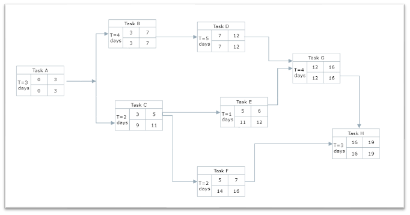

# S_PM_08: Scheduling via PDM

## Digram

**When is the delivery date?** 

``Early Finish :16 Unit time``

``Late Finish :19 Unit time``

**Which tasks could be delayed without delaying the schedule?**

``Task E, F can be delayed without delaying the project``
