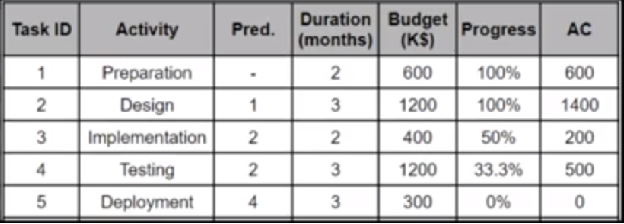

# S_PM_10: Monitoring via EVM

## Tasks



**How Much, Is It Over/ Under Budget?** 
``$600,000 Over the budget``

**How Many Days, Is It Ahead/Behind the Schedule?**
``more than 5 months late, it’s Behind the Schedule``

**By The End Of the Project, By How Much Will It Be Over/ Under Budget?**
``$600,000 more than the expected budget``

# Caluclations

- Planned value (PV)
- Earned value (EV)
- Actual cost (AC)
- Schedule variance (SV)
- Cost variance (CV)
<![endif]-->

ETC = (total budget - EV) / CPI.

`EAC = AC + ETC`
`SV = EV - PV`
`CV = EV- AC`
`PV = scheduled progress * budget.`
`SPI = EV/PV`

```
AC = 600 +1200+400+1200+300 = $3700

EV = 600+1400+ 200*50% + 500*33.3 + 300*0%= $2266.5

CPI= EV/AC= 2266.5/3700 = 0.613

ETC = (3700 – 2266.5) / 0.631 = $2271.8

EAC= 3700 + 2271.8 = $5971.8

CV = 2266.5 - 3700 = -1433.5
```
